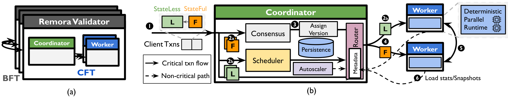

<p align="center">
  
</p>

<h1 align="center">Remora</h1>

<p align="center">
  <a href="https://arxiv.org/abs/2607.02817"></a>
  <a href="#license"></a>
  
</p>

Remora is a scale-out execution engine for blockchain validators. It uses an asymmetric architecture where a single **primary** (coordinator) node handles consensus and scheduling, while a pool of **proxy** nodes execute smart contracts in parallel with strict determinism guarantees. See more details in the paper - [*Remora: Scale-out Deterministic Execution for Smart Contracts*](https://arxiv.org/abs/2607.02817), which is to appear in VLDB26.

<p align="center">
  
</p>

## Highlights

- **Asymmetric architecture**: primary coordinator handles consensus/scheduling, proxy workers execute contracts
- **Strict determinism**: version-based execution ordering without coordination overhead
- **Stateless/stateful separation**: different scheduling policies for stateless crypto verification vs stateful execution
- **Consensus window optimization**: pre-consensus scheduling and stateless execution
- **Workload adaptiveness**: subgraph-first scheduling optimizes for locality and load balance
- **Elasticity**: dynamic proxy pool scaling without execution stalls

The implementation is ~13k lines of Rust and supports synthetic benchmarks (Fake), database benchmarks (TPC-C), and real-world blockchain transactions (Sui). Remora design is agnostic to smart-contracts, as long as it can provide read/write sets in advance. We carefully discuss this limitation in our paper.

## Motivation

TODO: why we need remora

## Documentation

| Document | Contents |
|----------|----------|
| [docs/setup.md](docs/setup.md) | Building, configuration, running (local and distributed), testing, metrics and Grafana |
| [docs/architecture.md](docs/architecture.md) | System components, directory structure, and a paper-to-code map |

## Reference

If you use Remora in your research, please cite:

```bibtex
@misc{remora,
  title         = {Remora: Scale-out Deterministic Execution for Smart Contracts},
  author        = {Liu, Zhengqing and Sonnino, Alberto and Zablotski, Igor and
                   Kokoris-Kogias, Eleftherios and Kogias, Marios},
  year          = {2026},
  eprint        = {2607.02817},
  archivePrefix = {arXiv},
  primaryClass  = {cs.DC},
  url           = {https://arxiv.org/abs/2607.02817}
}
```

## License

Apache License 2.0. See source file headers for details.
